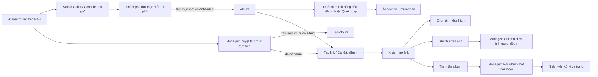

# Studio Gallery: luồng dữ liệu và giao diện

## Quy tắc mỗi phần

- **Console** chỉ quản lý quyền truy cập shared folder và lịch khám phá nguồn; không thay lịch quét riêng của album.
- **Duyệt thư mục** phản ánh cây NAS, dù thư mục đó chưa là album. Tạo album, link và mở cài đặt ngay tại thư mục đang xem.
- **Album** là đơn vị tạo link, lịch quét, nhân viên phụ trách và ghi chú nội bộ. Quét nội dung đệ quy dưới thư mục album.
- **Khách** chỉ thấy nội dung thuộc link và quyền được cấp. Ghi chú trên ảnh có thể ghim vị trí hoặc gửi không ghim; tin nhắn album là kênh chung của album.
- **Tin nhắn album** hiển thị một hội thoại cho mỗi album có tin nhắn, gồm cả lịch sử đã đọc. Huy hiệu bên trái chỉ đếm tin nhắn khách chưa đọc. Ghi chú ảnh nằm trong album. Ghi chú nội bộ/nhân viên không gửi cho khách.

## Trạng thái điều hướng

Manager có bốn màn hình chính: Duyệt thư mục, Hộp thư, Quản lý album, Cài đặt. Khi mở album từ thư mục hoặc hộp thư, các tab trong album gồm Tổng quan, Ảnh, Ảnh yêu thích, Cài đặt và hành động Tạo link. Quay lại phải trở về đúng màn hình đã mở album.

## Giới hạn hiện tại cần theo dõi

- Khám phá nguồn chạy mỗi 10 phút và có thể mất lâu trên NAS rất nhiều thư mục. Nó chỉ tạo album mới; album cũ theo lịch riêng.
- Thumbnail/video phụ thuộc codec có sẵn trên NAS. Tệp chưa hỗ trợ vẫn hiện trong cây thư mục nhưng có thể chưa có preview.
- Hội thoại hiện tải toàn bộ lịch sử của album; cần phân trang nếu lượng tin nhắn lớn.
